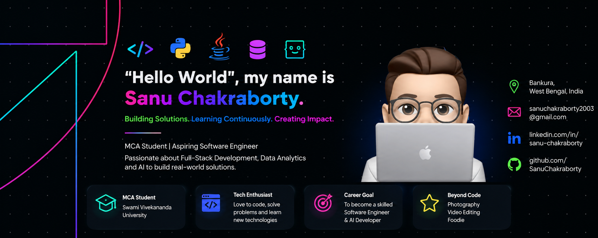

<p align="center"></p>
<p align="center">
<a href="https://www.linkedin.com/in/rak3xh/" target="blank"></a>
 <a href="https://twitter.com/rak3xh_" target="blank"></a>
 <a href="mailto:rakeshmondal859@gmail.com" target="blank"></a>
 <a href="https://rak3xh-portfolio.vercel.app/" target="blank"></a>
</p>


<div align="center">


</div>


 <h3 align="center"> C# .NET || VisualBasic .NET || C++ Developer || Part Time CS Player</h3>


<h3 align="center">Coding Profiles:</h3>
<p align="center">
<a href="https://leetcode.com/rak3xh/" target="blank"></a>
<a href="https://www.codingninjas.com/studio/profile/rak3xh" target="blank"></a>
<a href="https://auth.geeksforgeeks.org/user/rak3xh" target="blank"></a>
 <a href="https://www.hackerrank.com/profile/rakeshmondal859" target="blank"></a>

<!---
<a href="https://www.codechef.com/users/rak3xh" target="blank"></a>
<a href="https://codeforces.com/profile/rak3xh" target="blank"></a>
--->

</p>


```cpp
class TechStack {
public:
    vector<string> ProgrammingLanguages(){
        return{
           "C++", "C#","VisualBasic"
       };
    }
    vector<string> Frameworks(){
        return{
           ".NET ASP",".NET MVC"
       };
    }
   vector<string> WebDevelopment() {
        if(FrontEnd){
             return{
            "HTML5", "CSS3", "JavaScript", "ReactJs", "TailwindCss"
        };
     }
        else if(BackEnd){
              return{
            "PHP", "MySQL"
        };
     }
   }
   vector<string> Technologies(){
        return{
            "System Design","Azure AZ-104"
       };
    }
};
```


<details align="center">
  <summary style="cursor: pointer; background-color: #f0f0f0; padding: 5px 10px;"><b>Click to see more Stats!</b></summary>
  
  <div align="center">
  
 <p align="center">

 <p align="center">


 </p>
 <p align="center">


 </p>

</p>
  
  </div>

</details>

---

<h3 align="center"><b>S T R E A K</b></h3>

<p align="center"></p>


# Hi there, I'm [Your Name] 👋

<div align="center">
  
</div>

---

### 👨‍💻 About Me

*   🔭 I’m currently working on **advanced AI and Machine Learning models.**
*   🌱 I’m currently diving deeper into **Data Science and Cybersecurity principles.**
*   👯 I’m looking to collaborate on **innovative open-source projects and hacking challenges.**
*   💬 Ask me about **Algorithms, Data Structures, and Defense in Depth.**
*   📫 How to reach me: **[your.email@example.com](mailto:your.email@example.com)**
*   ⚡ Fun fact: **[Insert a cool fact about yourself or a fun coding quirk]**

---

### 🛠️ Tech Stack & Tools

**Languages & Frameworks:**
<br/>


**AI, Data Science & Security:**
<br/>


**Tools:**
<br/>


*(Note: You can add or remove badges easily using [Shields.io](https://shields.io/))*

---

### 📊 GitHub Stats

<div align="center">
  
</div>

<br/>

<div align="center">
  
</div>

---

### 🚀 Top Projects

| Project Name | Description | Tech Stack | Link |
|--------------|-------------|------------|------|
| **[Project 1 Name]** | A predictive anomaly detection system based on sensor readings. | Python, TensorFlow, Pandas | [View Repo](#) |
| **[Project 2 Name]** | Secure implementation demonstrating Defense in Depth principles. | C++, Cryptography | [View Repo](#) |
| **[Project 3 Name]** | AI-powered Tic-Tac-Toe with a highly interactive interface. | Python, AI Algorithms | [View Repo](#) |

---

<div align="center">
  <i>"Talk is cheap. Show me the code." - Linus Torvalds</i>
</div>
